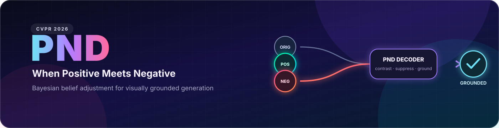
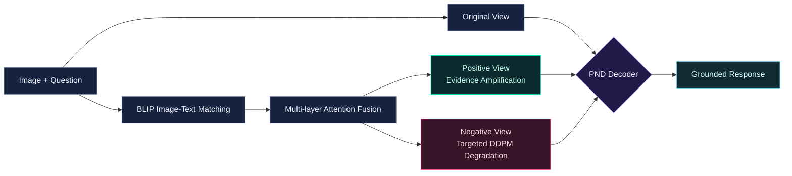

<p align="center">
  
</p>

<h1 align="center">Breaking the Illusion: When Positive Meets Negative in Multimodal Decoding</h1>

<p align="center"><strong>Official implementation · CVPR 2026</strong></p>

<p align="center">
  Yubo Jiang · Yitong An · Xin Yang · Abudukelimu Wuerkaixi · Xuxin Cheng<br/>
  Fengying Xie · Zhiguo Jiang · Cao Liu · Ke Zeng · Haopeng Zhang
</p>

<p align="center">
  
  <a href="https://arxiv.org/abs/2605.06679"></a>
  
  
  
</p>

<p align="center">
  <a href="#-why-pnd">Why PND</a> ·
  <a href="#-how-it-works">Method</a> ·
  <a href="#-results-at-a-glance">Results</a> ·
  <a href="#-quick-start">Quick Start</a> ·
  <a href="#-supported-backbones">Backbones</a> ·
  <a href="#-repository-map">Code Map</a> ·
  <a href="#-citation">Citation</a>
</p>

---

> **News · 2026** — *Breaking the Illusion* is accepted at **CVPR 2026**. The paper and official implementation are now public.

**Positive-and-Negative Decoding (PND)** is a training-free, plug-and-play inference framework for reducing object hallucination in vision-language models. PND treats hallucination as a Bayesian imbalance: an over-strong language prior can overwhelm underweighted visual evidence. It corrects that imbalance at every decoding step with an original view, a likelihood-amplified positive view, and a prior-isolating negative counterfactual.

<table align="center">
  <tr>
    <td align="center"><strong>+6.4%</strong><br/><sub>POPE accuracy</sub></td>
    <td align="center"><strong>+5.5%</strong><br/><sub>POPE F1</sub></td>
    <td align="center"><strong>4</strong><br/><sub>benchmark suites</sub></td>
    <td align="center"><strong>0</strong><br/><sub>training updates</sub></td>
  </tr>
</table>

## ✨ Why PND

| 🔎 Amplify likelihood | 🌓 Isolate the prior | ⚡ Adjust the belief |
|:---:|:---:|:---:|
| Fuses multi-layer cross-modal attention to strengthen query-aligned evidence | Degrades only consensus evidence regions with DDPM forward noise | Combines original, positive, and negative logits token by token |
| Recovers underweighted visual cues | Exposes prior-dominant hallucination tendencies | Applies an original-distribution confidence mask |

## 🧠 How it works



For every image-question pair, PND:

1. extracts multi-layer cross-modal attention maps with a BLIP image-text matching model;
2. averages normalized maps to amplify salient evidence in the positive view;
3. intersects layer-wise evidence and applies targeted DDPM corruption to form the negative view;
4. adjusts the next-token logits with positive and negative guidance, then masks candidates that are implausible under the original model.

The paper formulates the belief-adjusted logits as:

$$
\ell_{\mathrm{PND}} = \ell_{\mathrm{orig}} + \alpha\ell_{\mathrm{pos}} - \gamma\ell_{\mathrm{neg}},
\qquad
\ell_{\mathrm{final}} = \ell_{\mathrm{PND}} \odot
\mathbb{I}\!\left[\ell_{\mathrm{orig}} \geq \log(\beta) + \max(\ell_{\mathrm{orig}})\right].
$$

### Decoding controls

| Argument | Role | Default in release scripts |
|---|---|---:|
| `--alpha` | Positive likelihood-amplification weight | `2.2` |
| `--beta` | Original-distribution confidence threshold | `0.4` |
| `--gamma` | Negative prior-suppression weight | `0.4` |
| `--use_pnd` | Enable the positive PND stream | model-specific |
| `--use_negative_aug` | Enable the negative stream | model-specific |

## 📊 Results at a glance

PND improves visual grounding across object existence, attributes, open-ended captioning, and semantic consistency.

| Benchmark | What it evaluates | Paper highlight |
|---|---|---|
| **POPE** | Object-level hallucination | Average **+6.4% Accuracy** and **+5.5% F1** over greedy decoding |
| **MME** | Existence, count, position, and color | LLaVA-1.5-7B total: **531.67 → 621.67** |
| **CHAIR** | Open-ended caption hallucination | LLaVA-1.5-7B: **CHAIRs 51.0 → 46.0**, **CHAIRi 17.6 → 14.0** |
| **GCCCE** | Relevancy, accuracy, common sense, fine-grained precision | Consistent gains across all four dimensions |

> Results are reported in the paper using fixed hyperparameters. PND requires no model retraining.

## 🚀 Quick start

### 1. Create the environment

Install a CUDA-compatible PyTorch build for your machine, followed by the common runtime packages:

```bash
pip install transformers torchvision numpy scipy opencv-python matplotlib tqdm shortuuid
```

Install any additional dependencies required by the backbone you plan to evaluate. Model weights, COCO images, and POPE question files are not bundled with this repository.

### 2. Prepare the inputs

```text
/path/to/coco/val2014/                 # evaluation images
/path/to/coco_pope_adversarial.json    # POPE questions in JSONL format
/path/to/model/                        # selected backbone checkpoint
```

### 3. Run PND

<details open>
<summary><strong>LLaVA</strong></summary>

```bash
python code/script/run_llava.py \
  --model-path /path/to/llava-v1.5-7b \
  --image-folder /path/to/coco/val2014 \
  --question-file /path/to/coco_pope_adversarial.json \
  --answers-file outputs/llava_pnd.jsonl \
  --alpha 2.2 --beta 0.4 --gamma 0.4
```

</details>

<details>
<summary><strong>Qwen3-VL</strong></summary>

```bash
python code/script/run_qwen3vl.py \
  --model-path /path/to/Qwen3-VL-2B-Instruct \
  --image-folder /path/to/coco/val2014 \
  --question-file /path/to/coco_pope_adversarial.json \
  --answers-file outputs/qwen3vl_pnd.jsonl \
  --use_pnd --use_negative_aug \
  --alpha 2.2 --beta 0.4 --gamma 0.4
```

</details>

<details>
<summary><strong>InternVL</strong></summary>

```bash
python code/script/run_internvl_pope.py \
  --model-path /path/to/InternVL2-2B \
  --image-folder /path/to/coco/val2014 \
  --question-file /path/to/coco_pope_adversarial.json \
  --answers-file outputs/internvl_pnd.jsonl \
  --alpha 2.2 --beta 0.4 --gamma 0.4
```

</details>

> [!TIP]
> Run all commands from the repository root. Generated files under `outputs/` are ignored by Git.

## 🔌 Supported backbones

| Backbone | Scale(s) in the paper | Release entry point |
|---|---|---|
| LLaVA 1.5 | 7B / 13B | `code/script/run_llava.py` |
| Qwen-VL | 7B | `code/script/run_qwen_vl.py` |
| Qwen3-VL | 2B | `code/script/run_qwen3vl.py` |
| InternVL 2 | 2B | `code/script/run_internvl_pope.py` |
| InstructBLIP | 7B / 13B | Evaluated in the paper; LAVIS components are included |

## 🗺️ Repository map

```text
PND/
├── assets/
│   └── pnd-banner.svg          # README artwork
├── code/
│   ├── script/
│   │   ├── augmentation.py     # positive attention-guided view
│   │   ├── neg_augmentation.py # negative view construction
│   │   ├── sample_new.py       # PND decoding for LLaVA / Qwen
│   │   ├── sample_internvl.py  # PND decoding for InternVL
│   │   └── run_*.py            # backbone-specific entry points
│   ├── llava/                   # LLaVA integration
│   ├── Qwen_VL/                 # Qwen-VL integration
│   ├── InternVL/                # InternVL integration
│   └── lavis/                   # BLIP/LAVIS attention components
├── .gitignore
└── README.md
```

## 📝 Citation

If PND helps your research, please cite:

```bibtex
@inproceedings{jiang2026breaking,
  title     = {Breaking the Illusion: When Positive Meets Negative in Multimodal Decoding},
  author    = {Jiang, Yubo and An, Yitong and Yang, Xin and Wuerkaixi, Abudukelimu and Cheng, Xuxin and Xie, Fengying and Jiang, Zhiguo and Liu, Cao and Zeng, Ke and Zhang, Haopeng},
  booktitle = {Proceedings of the IEEE/CVF Conference on Computer Vision and Pattern Recognition},
  year      = {2026}
}
```

## 🙏 Acknowledgements

This repository incorporates components from [LAVIS](https://github.com/salesforce/LAVIS), [LLaVA](https://github.com/haotian-liu/LLaVA), [Qwen-VL](https://github.com/QwenLM/Qwen-VL), and [InternVL](https://github.com/OpenGVLab/InternVL). Original copyright and attribution notices are preserved in their respective source files.

---

<p align="center"><strong>Original view. Positive evidence. Negative counterfactual. Better grounded generation.</strong></p>
